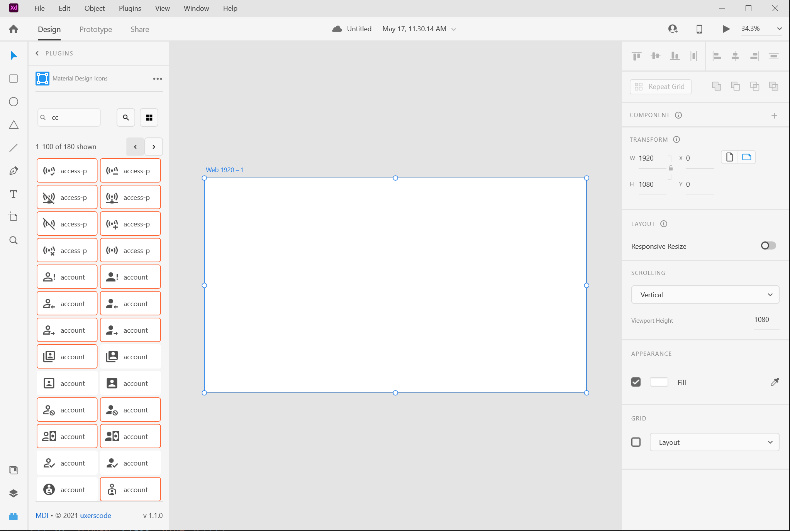

# MDI XD Plugin

The Material Design Icon Adobe XD Plugin provides the ability to easily access and add MDI icons into your XD design.

## Installation

Please download the plugin from the  [Adobe XD Plugins](https://www.adobe.com/xd/go/mdi). And, if you don't have Adobe XD, you can [download it](https://www.adobe.com/products/xd.html) for free!

## Usage

After you install the plugin, the Material Design Icon plugin will show on your list of plugins. Activate it, it will load (after several seconds) and you will see the icon list. 
Hover over an icon to see its name and author. Clicking on the icon adds it to the center of the workspace.
You can toggle the icons from this grid view to a list view showing both the icon and the name by clicking on the grid view button at the top right of the panel.
Filtering the list is done by adding the filter criteria into the text box and clicking on the filter button (this may take a little while).

### Notes
We know the performance is poor. There are over 5000 icons. Limitations in the XD Plugin API framework does not allow us to provide proper indication of progress. We felt that it was worth distributing the current version despite the obvious delays in the UI. We'll keep submitting requests for Adobe to improve the APIs and modifying the plugin as improvements are available.

## Development

Many thanks go to the [MDI](https://materialdesignicons.com) community for the creation and maintenance of the icon library.
Our plugin utilizes the [@mdi/svg](https://www.npmjs.com/package/@mdi/svg) package to populate the list of icons.

## uxerscode
We're designers and part time coders looking to make all our lives a little better. If this helps you, great. Pay it forward, please.
